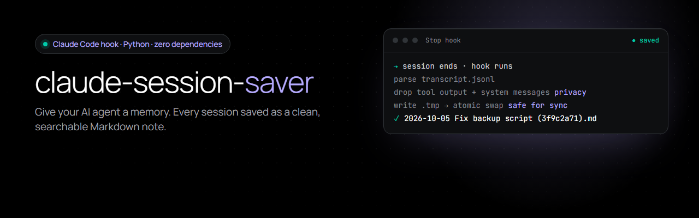
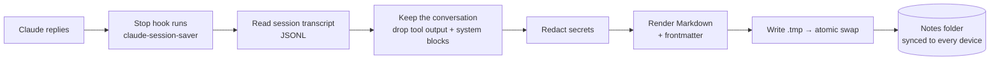

<p align="center">
  
</p>

<p align="center">
  <a href="https://github.com/ChanceHart/claude-session-saver/actions/workflows/tests.yml"></a>
  
  
  
  <a href="LICENSE"></a>
</p>

# claude-session-saver

**A [Claude Code](https://docs.anthropic.com/en/docs/claude-code) hook that saves every AI session as a clean, searchable Markdown note.**

AI chats forget everything when they end. I kept losing decisions and re-explaining context at the start of every session. This hook runs after every Claude reply and keeps one up-to-date note per session, so past work is searchable, linkable in Obsidian, and easy to pick up again.

## Quick start

```bash
pipx install git+https://github.com/ChanceHart/claude-session-saver
cd your-project
claude-session-saver install
```

That's it. Talk to Claude, and notes appear in `Journal/Sessions/Transcripts/`. Want your past sessions too?

```bash
claude-session-saver backfill
```

<sub>No pipx? `pip install git+https://github.com/ChanceHart/claude-session-saver` works too, or use the [single-file install](#single-file-install-no-pip).</sub>

## Features

| | |
|---|---|
| 🧠 **One note per session** | Rewritten after every reply, so it's always current. The session ID in the filename keeps it to one file per session. |
| 🔒 **Privacy by design** | Saves only your messages and Claude's replies. Tool output, file contents and system messages are **left out**; tools are listed by name only. |
| 🛡️ **Secret redaction** | API keys, tokens, private keys and `password=`-style values become `[REDACTED]` before anything is written. [Details](SECURITY.md) |
| 💾 **Safe writes** | Writes to a temp file, then swaps it in atomically, so OneDrive, Dropbox or iCloud never sync a half-written note. |
| ⚙️ **One-command setup** | `install` merges into your existing `settings.json`, keeps a backup, and is safe to run twice. `uninstall` removes only this hook. |
| 🗂️ **Obsidian-ready** | YAML frontmatter (`type`, `created`, `updated`, `tags`) and an optional backlink line. |
| 🪶 **Zero dependencies** | One Python file, standard library only. Runs on Windows, macOS and Linux. Never crashes your session. |

## How it works



## Commands

| Command | What it does |
|---|---|
| `claude-session-saver install` | Add the hook to this project's `.claude/settings.json` |
| `claude-session-saver install --global` | Add it for **every** project (`~/.claude/settings.json`) |
| `claude-session-saver install --dir "Notes/AI"` | Choose the notes folder (relative to the project, or an absolute path) |
| `claude-session-saver install --dry-run` | Show the resulting settings without writing anything |
| `claude-session-saver backfill` | Save notes for all past sessions of this project |
| `claude-session-saver uninstall` | Remove the hook (other settings and hooks are left alone) |
| `claude-session-saver --version` | Show the version |

## Configuration

Set these as environment variables, or in the `env` block of `.claude/settings.json` (`install --dir` does this for you).

| Variable | Default | What it does |
|---|---|---|
| `SESSION_SAVER_DIR` | `Journal/Sessions/Transcripts` | Notes folder (relative to the project, or absolute) |
| `SESSION_SAVER_FOOTER` | *(none)* | A line under each note's title, e.g. `See also: [[Current State]]` |
| `SESSION_SAVER_REDACT` | `1` | Set to `0` to turn off secret redaction |
| `CLAUDE_CONFIG_DIR` | `~/.claude` | Where Claude Code keeps its settings and transcripts |

## Example output

A shortened note (full version in [`examples/sample-session.md`](examples/sample-session.md)):

```markdown
---
type: session-transcript
created: 2026-10-05
session_id: 3f9c2a71-5d4e-4b8a-9c11-7e2f0a6b8d34
updated: 2026-10-05 14:26
tags: [session, transcript]
---
# Session transcript: 2026-10-05

### 🧑 **Me**
The nightly backup script failed again. Can you find out why?

### 🤖 **Claude**
The backup fails because the destination drive letter changed from `E:` to `F:` ...

_Tools used: Bash, Edit, Read_
```

## Single-file install (no pip)

1. Download [`save_session.py`](save_session.py) into your project's `.claude/hooks/` folder.
2. Run `python .claude/hooks/save_session.py install` (or paste [`settings.example.json`](settings.example.json) into `.claude/settings.json` yourself; on macOS/Linux use `python3`).

## Tests

```bash
python -m unittest discover tests -v
```

22 tests cover what matters most: tool output and system blocks never reach a note, secrets are redacted, corrupt lines are tolerated, one file is kept per session, atomic writes leave nothing behind, and `install` merges safely, backs up, and never duplicates itself. CI runs them on **Windows, macOS and Linux** with Python 3.9, 3.11 and 3.13.

## Design decisions

- **Why a Stop hook?** It fires after every reply, so a crash or closed window never loses more than one turn.
- **Why drop tool output?** It can contain file contents, credentials or API responses. The conversation is what's worth keeping; everything else stays out of the notes and out of cloud sync.
- **Why redact on top of that?** People paste keys into chats. Redaction catches the common formats before they're written to a synced folder.
- **Why atomic writes?** Notes live in synced folders. Writing in place lets a sync client upload a half-written file; `os.replace` makes the swap all-or-nothing.
- **Why absolute paths in the installed hook?** `install` points the hook at the exact Python that installed it, so it works no matter whether your system calls it `python`, `python3` or `py`.
- **Why exit 0 on errors?** A note-taking hook must never interrupt your work. Problems are printed to stderr instead.

## About

Built by **Chance Hart** with Claude Code as my pair programmer. I use this every day as part of an AI "second brain" that keeps my projects moving across devices.

Portfolio: **[chancehart.github.io](https://chancehart.github.io)** · LinkedIn: **[chance-hart-ai](https://www.linkedin.com/in/chance-hart-ai)**

[Changelog](CHANGELOG.md) · [Security](SECURITY.md) · [MIT License](LICENSE)
