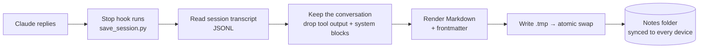

<p align="center">
  
</p>

<p align="center">
  
  
  
  
</p>

# claude-session-saver

**A [Claude Code](https://docs.anthropic.com/en/docs/claude-code) hook that saves every AI session as a clean, searchable Markdown note.**

AI chats forget everything when they end. I kept losing decisions and re-explaining context at the start of every session. This hook runs after every Claude reply and keeps one up-to-date note per session, so past work is searchable, linkable in Obsidian, and easy to pick up again.

## Features

| | |
|---|---|
| 🧠 **One note per session** | Rewritten after every reply, so it's always current. The session ID in the filename keeps it to one file per session. |
| 🔒 **Privacy by design** | Saves only your messages and Claude's replies. Tool output, file contents and system messages are **left out**; tools are listed by name only. |
| 💾 **Safe writes** | Writes to a temp file, then swaps it in atomically, so OneDrive/Dropbox/iCloud never sync a half-written note. |
| 🗂️ **Obsidian-ready** | YAML frontmatter (`type`, `created`, `updated`, `tags`) and an optional backlink line. |
| 🪶 **Zero dependencies** | One Python file, standard library only. Tolerates corrupt or partial transcript lines. |

## How it works



## Install (2 minutes)

1. Copy `save_session.py` into your project's `.claude/hooks/` folder.
2. Add the hook to `.claude/settings.json` (full file in [`settings.example.json`](settings.example.json)):

   ```json
   {
     "hooks": {
       "Stop": [{ "hooks": [{
         "type": "command",
         "command": "python \"$CLAUDE_PROJECT_DIR/.claude/hooks/save_session.py\"",
         "timeout": 60,
         "async": true
       }]}]
     }
   }
   ```
3. Talk to Claude. Notes appear in `Journal/Sessions/Transcripts/`.

### Configuration (optional)

| Variable | Default | What it does |
|---|---|---|
| `SESSION_SAVER_DIR` | `Journal/Sessions/Transcripts` | Output folder (relative to the project, or an absolute path) |
| `SESSION_SAVER_FOOTER` | *(none)* | A line under each note's title, e.g. `See also: [[Current State]]` |

## Example output

A shortened note (from [`examples/sample-session.md`](examples/sample-session.md)):

```markdown
---
type: session-transcript
created: 2026-10-05
session_id: 3f9c2a71-5d4e-4b8a-9c11-7e2f0a6b8d34
updated: 2026-10-05 14:26
tags: [session, transcript]
---
# Session transcript: 2026-10-05

### 🧑 **Me**
The nightly backup script failed again. Can you find out why?

### 🤖 **Claude**
The backup fails because the destination drive letter changed from `E:` to `F:` ...

_Tools used: Bash, Edit, Read_
```

## Tests

```bash
python -m unittest discover tests -v
```

The 9 tests cover the parts that matter most: tool output and system blocks never reach a note, meta and sub-agent entries are skipped, corrupt lines are tolerated, one file is kept per session, and atomic writes leave no temp files behind.

## Design decisions

- **Why a Stop hook?** It fires after every reply, so a crash or closed window never loses more than one turn.
- **Why drop tool output?** It can contain file contents, credentials or API responses. The conversation is what's worth keeping; everything else stays out of the notes (and out of cloud sync).
- **Why atomic writes?** The notes live in a synced folder. Writing in place lets the sync client upload a half-written file; `os.replace` makes the swap all-or-nothing.

## About

Built by **Chance Hart** with Claude Code as my pair programmer. I use this every day as part of an AI "second brain" that keeps my projects moving across devices.

Portfolio: **[chancehart.github.io](https://chancehart.github.io)** · LinkedIn: **[chance-hart-ai](https://www.linkedin.com/in/chance-hart-ai)**

Licensed under the [MIT License](LICENSE).
